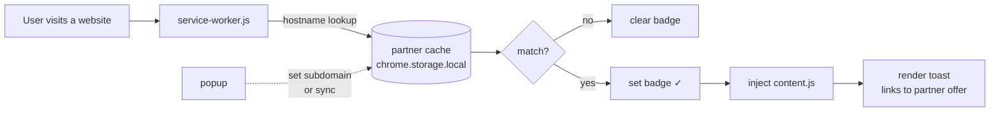
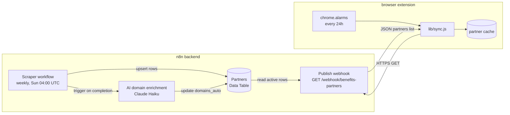

# Benefits@Work Notifier

Chrome / Firefox extension (Manifest V3) that pings you with a Honey-style toast
when you visit a partner site of your Benefits@Work platform, and links you
straight to the matching offer page on your company's subdomain.

Runs on Chrome (and other Chromium browsers) and Firefox 121+. The codebase is
shared; only the manifest differs between the two targets.

## Status

**Automated weekly sync.** The extension fetches a fresh partner list
from a self-hosted n8n webhook every 24 hours (and on first install). The
webhook is backed by:

- **Weekly scraper** (Sundays @ 04:00 UTC) that logs into the platform,
  crawls all 11 categories, parses every offer card, fetches each offer page,
  and extracts the merchant domain(s) from the CTA's `data-href` attribute.
- **AI domain enrichment** (Claude Haiku via an OpenAI-compatible LLM
  gateway) that runs **automatically** after every scrape. It walks every
  partner row, takes the currently-stored domains as context, and decides the
  final list — keeping correct entries, dropping affiliate domains, and
  expanding national TLD variants (`.com` / `.be` / `.nl` / `.fr`) where
  appropriate.
- **Public publish webhook** serving the list as `application/json`. The
  default endpoint is hardcoded in `lib/sync.js`.

If the webhook is unreachable on first install, the extension falls back to a
small bundled seed list (`data/offers.js`) so it still works.

## Features

- Detects partner sites as you browse (suffix-matching `adidas.com` matches
  `www.adidas.com`, `shop.adidas.com`, …).
- Shows a dismissible bottom-right toast on every partner page load.
- Per-tab dismissal: closing the toast suppresses it for that partner in that
  tab until you navigate away and come back.
- Action toolbar icon shows a tan ✓ badge on partner pages.
- Configurable platform subdomain via the popup (default empty — set yours
  on first run).
- Manual "Sync now" button + automatic 24 h refresh via `chrome.alarms`.
- Pure vanilla MV3 — no build step, no dependencies.

## Install

Pre-built downloads are on the
[latest release](https://github.com/QinClaes/corporate-benefits-scanner-extension/releases/latest).
The artifacts are produced automatically by GitHub Actions on every version
tag — see [`RELEASING.md`](RELEASING.md) for the release flow.

### Chrome / Chromium / Brave / Edge / Vivaldi

1. Download
   [`benefits-notifier-chrome.zip`](https://github.com/QinClaes/corporate-benefits-scanner-extension/releases/latest/download/benefits-notifier-chrome.zip)
   from the latest release.
2. Unzip it (double-click on macOS, right-click → **Extract All** on Windows).
3. Open `chrome://extensions` (paste the URL into the address bar).
4. Toggle **Developer mode** on (top-right corner).
5. Click **Load unpacked** and pick the unzipped folder.
6. Pin the extension icon to the toolbar so the badge is visible.

The install is permanent — it survives Chrome restarts. Chrome shows a
"Disable developer mode extensions" banner on each startup; that's cosmetic
and the extension keeps working. Don't delete or move the unzipped folder
after install: Chrome stores a path reference to it.

### Firefox

**Direct install only works on Firefox forks that allow unsigned extensions:
[LibreWolf](https://librewolf.net/),
[Firefox Developer Edition](https://www.mozilla.org/firefox/developer/),
[Firefox Nightly](https://www.mozilla.org/firefox/channel/desktop/#nightly),
or [Waterfox](https://www.waterfox.net/).** Stock Firefox is not supported
because Mozilla requires every extension on Firefox stable to be signed by
them, and this extension isn't published on AMO.

1. Download
   [`benefits-notifier-firefox.xpi`](https://github.com/QinClaes/corporate-benefits-scanner-extension/releases/latest/download/benefits-notifier-firefox.xpi)
   from the latest release.
2. Drag-and-drop the `.xpi` file onto a browser window.
3. Click **Add** in the install prompt.
4. Pin the toolbar button so the badge is visible.

If install is blocked, open `about:config` and verify that
`xpinstall.signatures.required` is `false` (default-false on LibreWolf and
Waterfox; needs to be flipped manually on Firefox Dev / Nightly).

Note: Firefox treats `<all_urls>` as an *optional* host permission. On first
install the toolbar button shows a "permission required" prompt and you have
to grant access per-site or via "Always Allow on All Sites". This is a Firefox
policy difference, not an extension bug.

## Build from source (developers)

There is no build step. To run from a clone of this repo:

- **Chrome / Chromium**: clone the repo, then in `chrome://extensions` →
  Developer mode → **Load unpacked** → pick the repo folder. Skip the zip
  entirely.
- **Firefox forks**: copy the repo to a scratch directory, rename
  `manifest.firefox.json` → `manifest.json` in the copy, then
  `about:debugging#/runtime/this-firefox` → **Load Temporary Add-on…** → pick
  any file in the copy. Note that Firefox temporary add-ons are unloaded when
  the browser quits — for a persistent install, use the `.xpi` from a release.
  Don't commit the renamed file: the canonical Chrome `manifest.json` lives at
  the repo root.

To cut a release (produces both artifacts via GitHub Actions), see
[`RELEASING.md`](RELEASING.md).

## First-run setup

1. Click the extension icon to open the popup.
2. In the **Platform subdomain** field, enter your company's subdomain (e.g.
   `yourcompany` for `yourcompany.benefitsatwork.be`). Letters, digits and hyphens only.
3. Click **Save**.
4. The first sync runs automatically on install. You can also click
   **Sync now** to refresh on demand.

Until a subdomain is set, the toast still appears on partner sites but its
"View on Benefits@Work →" button is disabled and explains how to fix it.

## How it works

### Runtime flow (in the browser)

When the user navigates, the service worker checks the hostname against a
cached partner list and shows a toast if there's a match. The popup writes
the subdomain and triggers manual syncs.



### Backend pipeline (n8n side)

The n8n side scrapes the partner platform, runs AI enrichment for national
TLD variants, and exposes the result via a public webhook. The extension
fetches that webhook every 24 hours and on first install.



Storage layout (`chrome.storage.local`):

| Key | Type | Purpose |
|---|---|---|
| `subdomain` | string | Company subdomain (e.g. `yourcompany`) |
| `syncEndpoint` | string | n8n webhook URL (default below; user-editable later) |
| `partners` | array | Cached partner list from the webhook |
| `syncedAt` | ISO datetime | Last successful sync |
| `syncError` | string \| null | Last sync error |
| `syncCount` | number | Number of partners in last sync |

Default endpoint: see `DEFAULT_SYNC_ENDPOINT` in `lib/sync.js`.

## File layout

```
benefits-notifier/
├── manifest.json              MV3 manifest for Chrome/Chromium (alarms perm, n8n host)
├── manifest.firefox.json      MV3 manifest for Firefox 121+ (gecko id + scripts background)
├── service-worker.js          tab listener + badge + alarm + sync orchestration
├── content.js                 toast renderer (idempotent, classic script)
├── data/
│   └── offers.js              bundled seed (fallback when webhook unreachable)
├── lib/
│   ├── matcher.js             domain normalisation + suffix match
│   └── sync.js                webhook fetch + cache persistence
├── popup/
│   ├── popup.html
│   ├── popup.css
│   └── popup.js               subdomain + sync UI + partner list
├── n8n/                       n8n workflow exports (.json + .ts) and research HTML
├── .github/workflows/release.yml  CI: tag push → build .zip + .xpi → GitHub Release
├── RELEASING.md               release flow (tagging + what the workflow does)
└── README.md                  this file
```

For an orientation aimed at AI assistants and new contributors, see [`AGENTS.md`](AGENTS.md).
For the release flow, see [`RELEASING.md`](RELEASING.md).
For the n8n side (setup, env vars, Data Table schema, re-import order), see [`n8n/README.md`](n8n/README.md).

## n8n backend

Three workflows hosted on a self-hosted n8n instance. JSON + `.ts` exports of all three live under `n8n/workflows/` so a fresh n8n instance can re-import them; see [`n8n/README.md`](n8n/README.md) for the import order and the env vars (`BENEFITS_EMAIL`, `BENEFITS_PASSWORD`, `BENEFITS_PLATFORM_HOST`, `N8N_API_KEY`) you need first.

| Workflow | ID | Purpose |
|---|---|---|
| **Scraper (weekly)** | `NFJp7ok1KAJiATza` | Login + crawl + parse + upsert to `partners` table. Runs Sundays @ 04:00 UTC. Chains the AI enrichment workflow on completion. |
| **AI domain enrichment** | `hZ8RXCqu0NkYblga` | Claude Haiku via an OpenAI-compatible LLM gateway. Reviews every row, takes existing domains as context, produces the final list. Triggered by the scraper. |
| **Publish webhook** | `0s5zRkxl2B0wbtbp` | Public GET `/webhook/benefits-partners`. Reads `domains_auto`, returns active partners. |

The `partners` n8n Data Table holds:
- `offer_id`, `name`, `offer_path`, `cat_id`, `primary_category`, `logo_url`
- `domains_auto` — JSON array, the source of truth (written by scraper + AI)
- `status` (active / archived), `last_seen_at`, `domain_resolved_at`, `notes`

(`domains_manual` exists in the schema but is no longer read; the AI is
trusted as the final authority. If the AI gets a partner wrong, edit
`domains_auto` directly — note that the next weekly run may overwrite it.)

## Updating partner data

- **Automatic weekly run** — every Sunday at 04:00 UTC, scraper runs and then
  triggers AI enrichment.
- **Run manually** — execute workflow `NFJp7ok1KAJiATza` in n8n; it chains
  the AI enrichment automatically when it finishes.
- **Run AI enrichment standalone** — execute `hZ8RXCqu0NkYblga` to re-derive
  domains from the current table without re-scraping.
- **Manual fix** — edit `domains_auto` on a row in the n8n Data Table UI.
  The fix lasts until the next AI enrichment run.

## Permissions

| Permission | Why |
|---|---|
| `tabs` | Read the URL of the active tab to check it against the partner list. Without this, `tab.url` is `undefined`. |
| `storage` | Persist subdomain, partner cache, and sync state. |
| `scripting` | Inject `content.js` into matched tabs only (no static `content_scripts`). |
| `alarms` | 24 h periodic partner-list refresh. |
| `host_permissions: ["<all_urls>"]` | Detect partner sites at any domain. The extension does not read page content beyond what's needed to inject the toast. |
| `host_permissions: ["https://<n8n-host>/*"]` | Sync the partner list from the publish webhook. The exact host is in `lib/sync.js` and both manifests' `host_permissions`. |

## License

Private / personal-use only at this stage.
